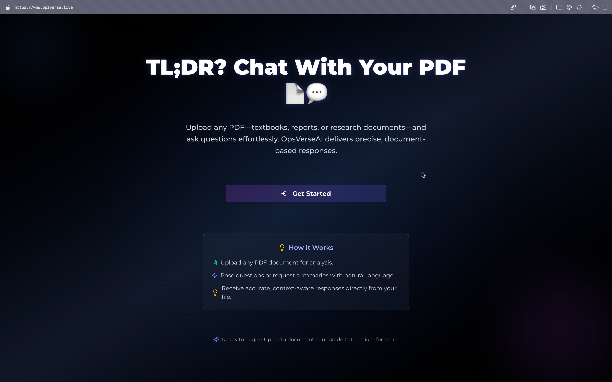
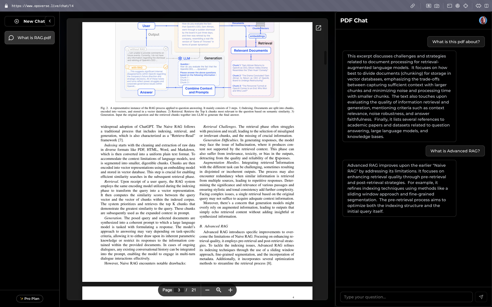
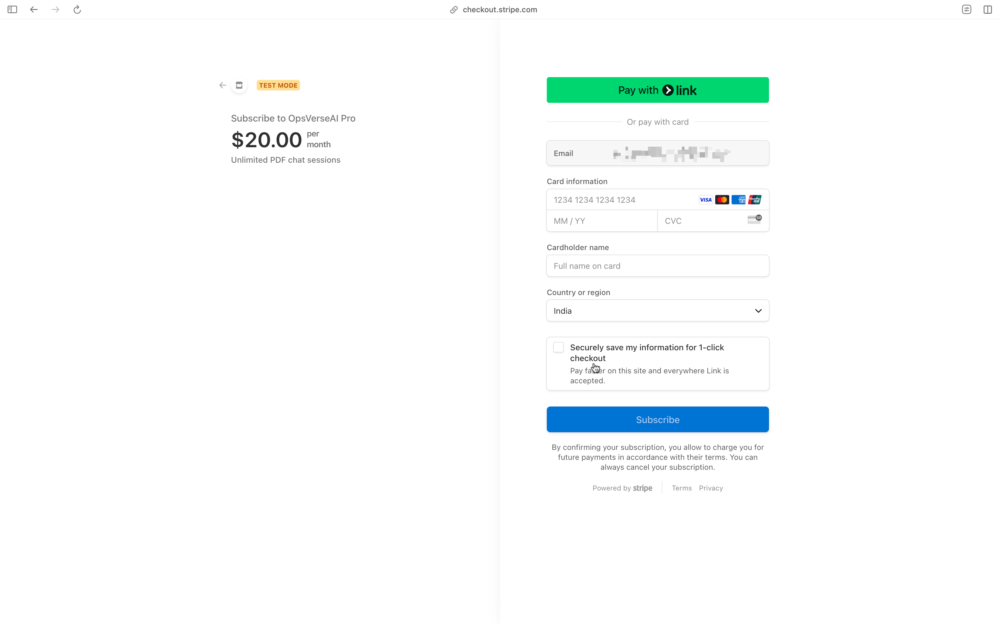

# ⚡️ OpsVerseAI — Intelligent PDF Chat Revolution

<p align="center">
  
</p>
<p align="center"><em>Transform static PDFs into dynamic, AI-powered conversations. Upload, ask, and unlock insights effortlessly.</em></p>

<a id="quick-overview"></a>
## 🌟 Quick Overview

OpsVerseAI is an innovative Next.js-based application that redefines document interaction. Upload any PDF—be it textbooks, research papers, or reports—and engage in natural, context-aware conversations powered by advanced AI (Gemini API) and vector search (Pinecone). With secure authentication (Clerk), premium subscriptions (Stripe), and a responsive UI (Tailwind CSS), it’s built for efficiency and scalability.

**[Live Demo](#live-demo) | [GitHub Repository](#repository) | [Documentation](#documentation)**

[](https://github.com/Prayag-09/OpsVerseAI)  
[](https://github.com/Prayag-09/OpsVerseAI/issues)  
[](LICENSE)  
[](https://github.com/Prayag-09/OpsVerseAI/commits/main)

---

## 📑 Table of Contents

- [🌟 Quick Overview](#quick-overview)
- [🚀 Features](#features)
- [🛠 Tech Stack](#tech-stack)
- [📦 Installation](#installation)
- [🎮 Usage](#usage)
- [⚙️ Configuration](#configuration)
- [🤝 Contributing](#contributing)
- [📬 Contact](#contact)
- [📊 Screenshots](#screenshots)
---

<a id="features"></a>
## 🚀 Features

- **AI-Powered PDF Chat**: Upload PDFs and query with natural language (e.g., “Summarize Chapter 3” or “Explain Figure 2”).
- **Secure Authentication**: Robust sign-in/sign-up via Clerk with session management.
- **Premium Subscriptions**: Stripe-integrated upgrades with real-time webhook updates.
- **Chat History**: Save and resume conversations seamlessly.
- **Mobile-First Design**: Fully responsive UI optimized for all devices.
- **Vector-Based Search**: Pinecone-powered chunk retrieval for precise, context-aware responses.
- **Cloud Storage**: AWS S3 for secure PDF uploads.
- **Error Resilience**: Advanced handling for subscription and API edge cases.

---
<a id="tech-stack"></a>
## 🛠 Tech Stack

| **Category**       | **Technologies**                           |
| ------------------ | ------------------------------------------ |
| **Frontend**       | Next.js, React, Tailwind CSS               |
| **Backend**        | Node.js, Gemini API                        |
| **Infrastructure** | PostgreSQL (Drizzle ORM), Pinecone, AWS S3 |
| **Payments**       | Stripe                                     |
| **Authentication** | Clerk                                      |
| **Language**       | TypeScript                                 |

---
<a id="installation"></a>
## 📦 Installation

Get OpsVerseAI running locally with these steps:

### 1. Clone the Repository

```bash
git clone https://github.com/Prayag-09/OpsVerseAI.git
cd OpsVerseAI
```

### 2. Install Dependencies

```bash
npm install
```

### 3. Configure Environment Variables

Create a `.env.local` file in the root directory and populate it with:

```plaintext
# Database
NEXT_PUBLIC_DATABASE_URL=your_postgres_connection_string

# Clerk
NEXT_PUBLIC_CLERK_PUBLISHABLE_KEY=your_publishable_key
CLERK_SECRET_KEY=your_secret_key
NEXT_PUBLIC_CLERK_SIGN_IN_URL=/sign-in
NEXT_PUBLIC_CLERK_SIGN_UP_URL=/sign-up

# AWS S3
NEXT_PUBLIC_AWS_ACCESS_KEY_ID=your_access_key
NEXT_PUBLIC_AWS_SECRET_ACCESS_KEY=your_secret_key
NEXT_PUBLIC_AWS_REGION=your_region
NEXT_PUBLIC_AWS_BUCKET_NAME=your_bucket_name

# Pinecone
PINECONE_API_KEY=your_pinecone_api_key
PINECONE_INDEX_NAME=your_pinecone_index_name

# Gemini API
GEMINI_API_KEY=your_gemini_api_key

# Stripe
STRIPE_API_KEY=your_stripe_api_key
STRIPE_WEBHOOK_SIGNING_SECRET=your_webhook_secret
```

- **Clerk**: Retrieve keys from [Clerk Dashboard](https://dashboard.clerk.com/).
- **Stripe**: Obtain from [Stripe Dashboard](https://dashboard.stripe.com/).
- **AWS**: Configure via [AWS Management Console](https://aws.amazon.com/).
- **Pinecone**: Sign up at [Pinecone.io](https://www.pinecone.io/) for an API key.
- **Gemini**: Get your key from [Google AI Studio](https://aistudio.google.com/).

### 4. Set Up Database

- Install PostgreSQL locally or use a cloud provider (e.g., Supabase).
- Initialize the schema with Drizzle:
  ```bash
  npx drizzle-kit generate
  npx drizzle-kit push
  ```

### 5. Run the Application

```bash
npm run dev
```

Open [http://localhost:3000](http://localhost:3000) in your browser.

---

<a id="usage"></a>
## 🎮 Usage

1. **Sign In**: Authenticate using Clerk.
2. **Upload PDFs**: Available for Premium users (upload via the home page).
3. **Interact**: Ask questions or request summaries (e.g., “What’s the main point?”).
4. **Upgrade**: Subscribe via Stripe for full access.
5. **Resume**: Access saved chats from the homepage.

### Testing Premium

- **Card Number**: `4242 4242 4242 4242`
- **Expiry Date**: Any future date
- **CVC / ZIP**: Any valid number

---
<a id="configuration"></a>
## ⚙️ Configuration

- **Stripe Webhook**: Register `/api/webhook` in [Stripe Dashboard](https://dashboard.stripe.com/webhooks) to handle subscription events.
- **Clerk Setup**: Configure sign-in/sign-up URLs and fallback routes in [Clerk Dashboard](https://dashboard.clerk.com/).
- **Pinecone Index**: Create an index in [Pinecone Console](https://app.pinecone.io/) and set the `PINECONE_INDEX_NAME`.
- **AWS S3**: Set up a bucket and IAM user with `s3:PutObject` permissions.

---
<a id="contributing"></a>
## 🤝 Contributing

We ❤️ contributions! Here’s how to get involved:

1. **Fork the Repository**: Create your own copy on GitHub.
2. **Create a Branch**: `git checkout -b feature/your-feature`.
3. **Make Changes**: Follow TypeScript/ESLint conventions.
4. **Test Locally**: Run `npm run dev` and verify functionality.
5. **Submit a PR**: Include a clear description and update documentation.
6. **Review**: Address feedback and iterate.

<a id="contact"></a>
## 📬 Contact

- **Email**: [prayagtushar2016@gmail.com](mailto:prayagtushar2016@gmail.com)
- **LinkedIn**: [linkedin.com/in/prayagtushar](https://www.linkedin.com/in/prayagtushar)
- **GitHub**: [github.com/Prayag-09](https://github.com/Prayag-09)

<a id="screenshots"></a>
## 📊 Screenshots

  
  


---

_Last Updated: April 11, 2025_  
_Built with ❤️ by Tushar Prayag_
